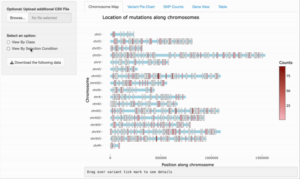
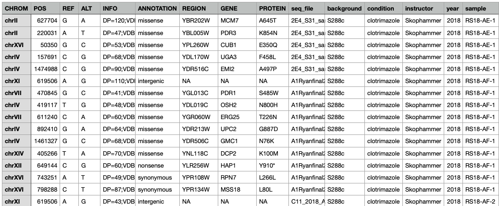
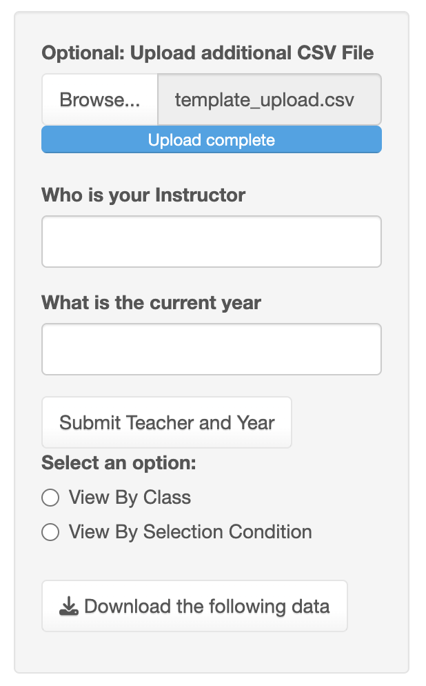
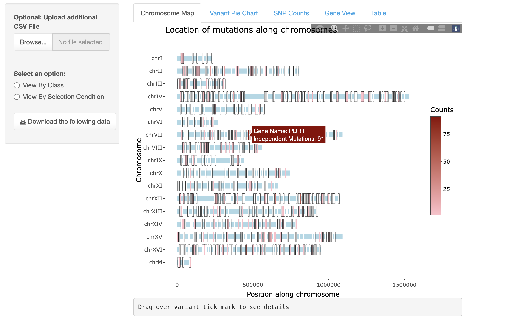
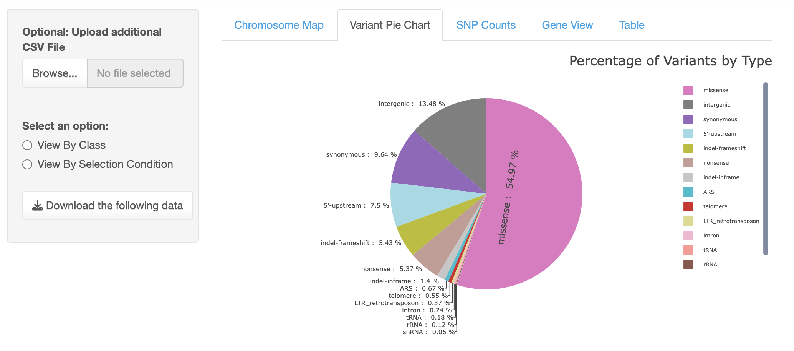
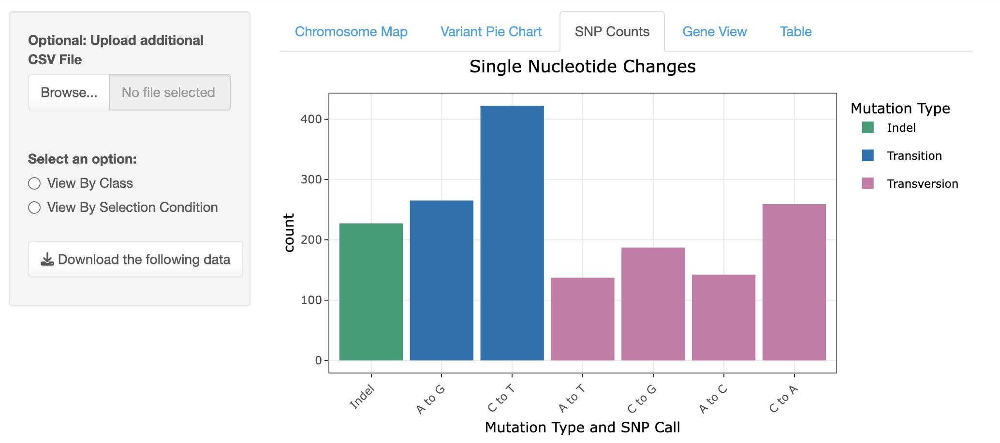
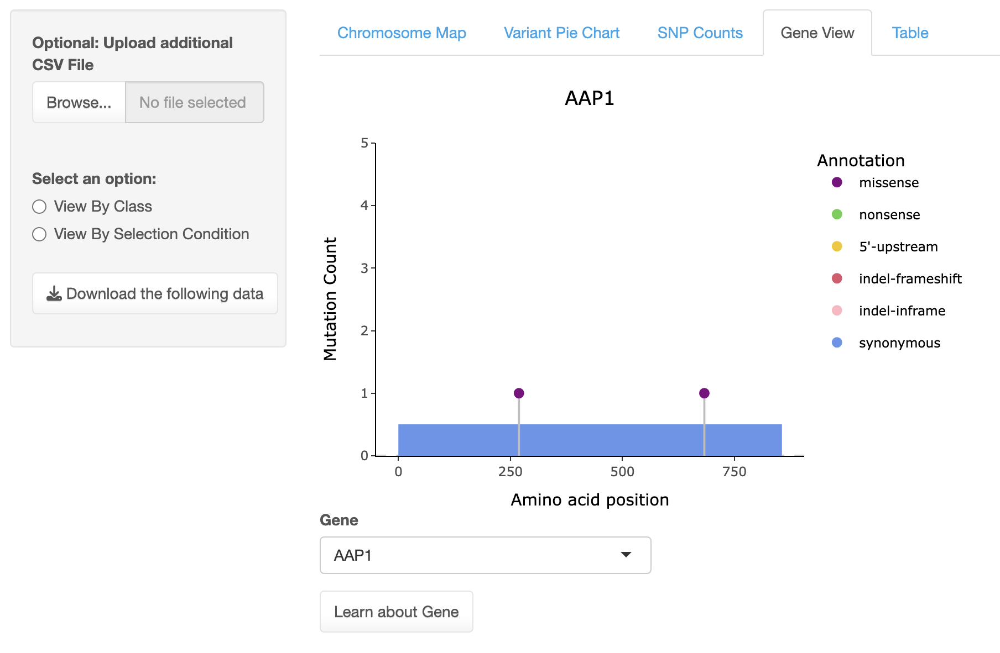

# yEvo Mutation Browser


## Overview

The yEvo Mutation Browser is a web tool that enables users to visualize evolved strain mutations in yEvo data at both
the gene and chromosome levels, compare findings under various conditions, and upload their own data, benefiting both
educators and the yeast genetics community.

The yEvo Mutation Browser enables users to visualize mutations in the _Saccharomyces cerevisiae_ (_S. cerevisiae_) genome via several interactive graphs, including a chromosome map, mutation spectra, pie chart of mutation types, and gene view.
This was built for high school students in the yEvo program, who have experimentally evolved yeast to adapt to various conditions.
Therefore, all cumulative yEvo data is bundled within the app and is always available there.
However, users outside of yEvo can also use this tool to upload their own mutation data and use the interactive visualizations, making it a tool for both educational and research use.

### Jump to

- [yEvo Mutation Browser](#yevo-mutation-browser)
  - [Overview](#overview)
    - [Jump to](#jump-to)
  - [Usage](#usage)
    - [Filtering](#filtering)
    - [Uploading Data](#uploading-data)
    - [Chromosome Map](#chromosome-map)
    - [Variant Pie Chart](#variant-pie-chart)
    - [SNP Counts](#snp-counts)
    - [Gene View](#gene-view)
  - [Running Locally](#running-locally)
  - [Modifying to Other Organisms](#modifying-to-other-organisms)
    - [`ORGANISM_GENE_INFO_LINK_FUNCTION`](#organism_gene_info_link_function)

## Usage

The easiest method to use the mutation browser is to access it via the web at [https://yevo.org/mutation-browser/](https://yevo.org/mutation-browser/).
To run the mutation browser locally, see the section [Running Locally](#running-locally) below.

The yEvo Mutation browser contains two sections: the filtering column on the left and the visualizations on the right.
Upon first loading, the app displays mutation data across the entire yEvo dataset.
The user has the option to: 1. change what data is being visualized \([Filtering](#filtering)\) and 2. change the visualization method.
Both options are detailed below.

### Filtering

By default, the mutation browser displays all data.
Users can filter this data in two ways: by student class or by
selection condition.

As shown below, when selected, dropdowns appear corresponding to either option.


```raw
├── View by Class                  
│   ├── Instructor Dropdown                    
│   ├── Year Dropdown                     
│   └── Sample Name Dropdown                    
└── View by Condition                  
    └── Condition Dropdown
```

Below is an example of filtering on the Chromosome Map



### Uploading Data

> [!IMPORTANT]
> Uploaded data is only available temporarily on the single instance of the app to which the data is uploaded.
> The data will **NOT** persist when the web app is closed and your data is not stored in the app.

By default, the mutation browser is preloaded with all mutation data collected from yEvo experiments since 2018.
Users can explore this dataset, or upload their own temporarily.

To upload, users must have their mutation data (in .csv form) in the following format:



The CSV file **MUST** have the following columns:

- **CHROM**: the chromosome number in the form of `chr` followed by the chromosome number in uppercase Roman numerals.
- **POS**: the position of the mutation on the chromosome.
- **ID**:  @LEAH HELP!!
- **REF**: @LEAH actually can you just help with all the rest of these, ty!!!
- **ALT**: 
- **QUAL**: 
- **FILTER**: 
- **INFO**: 
- **ANNOTATION**: 
- **REGION**: 
- **GENE**: 
- **PROTEIN**: 
- **seq_file**: 
- **background**: 
- **condition**: 
- **instructor**: 
- **year**: 
- **sample**: 

After uploading, the browser will ask for additional information (instructor and year):



> [!NOTE]
> To make your data persist in the mutation browser, you need to run the web app locally \(see [Running Locally](#running-locally) below\).
> Then, you can permanently edit the master file by appending your data so that your data will always appear in the browser.

### Chromosome Map

The Chromosome Map is a linear representation of the 16 nuclear chromosomes along with the mitochondrial genome of _Saccharomyces cerevisiae_.
This plot displays the locations of all mutated genes in the selected dataset, marked at their chromosomal positions.
Tick marks along the linear chromosomes indicate these sites, and hovering the mouse over each tick mark reveals the name of the mutated gene, as well as how many times it was mutated in repeat experiments.
Users can also zoom in on specific regions by clicking and dragging, offering a closer look at mutations in a given area.



### Variant Pie Chart

The Variant Pie Chart displays the distribution of mutation types identified by the sequencing analysis pipeline.
Unlike the chromosome plot, which focuses solely on the locations of mutated genes, the pie chart encompasses all variants, including those in non-coding regions.



### SNP Counts

This plot illustrates the distribution of single nucleotide polymorphisms (SNPs) and small insertions and deletions (indels).
By categorizing the different types of SNPs, the mutation spectrum provides insights into the underlying biochemical processes that drive DNA mutations.



### Gene View

Gene View is a linear lollipop plot that displays the position of coding mutations along the protein product of each mutated gene.
In this view, users can select a mutated gene from a dropdown menu based on the selected dataset.
Once a gene is selected, the plot reveals the length of the amino acid sequence and color-coded lollipops indicating where mutations occurred.
The colors differentiate between mutation types, such as missense, nonsense, synonymous, or 5’-upstream mutations.
The height of each lollipop reflects how frequently that particular site in the protein was mutated within the dataset.



## Running Locally

> [!IMPORTANT]
> [R](https://www.r-project.org/) needs to be installed before you can run the yEvo Mutation Browser locally.

To make your data persist locally in the app, to contribute to the yEvo Mutation Browser, or to modify the mutation browser to better fit your needs or to another organism, you can run the yEvo Mutation Browser locally.

To do so, clone the repository:

```sh
git clone https://github.com/dunhamlab/yEvoMutBrowser.git
```

Then, navigate to the repository:

```sh
cd yEvoMutBrowser
```

To run the app, run the app using the following:

```sh
Rscript app.R
```

The app will tell you how to access it locally such as:

```sh
Listening on http://xxxxxxx
```

Copy and paste this link into a web browser of your choice to access the mutation browser.

## Modifying to Other Organisms

The yEvo Mutation Browser can be modified for studying and visualizing mutations in other organisms.

The yEvo Mutation Browser is specific to _S. cerevisiae_ because of the constants set in the `R/organism.R` file:

- **`ORGANISM_GENE_INFO_PATH`**: the path to the CSV file with the information on all the genes in the organism being studied and visualized.
- **`ORGANISM_CHROMOSOME_INFO_PATH`**: the path to the CSV file with the information on the chromosomes in the organism being studied and visualized.
- **`ORGANISM_GENE_INFO_LINK`**: the link to a database with gene information. If this is set to `"NONE"`, then the "Learn about gene" button in the [Gene View](#gene-view) visualization will not appear.
- **`ORGANISM_GENE_INFO_LINK_FUNCTION`**: the function that generates specific links for each gene in an online gene information database for the "Learn about gene" button in the [Gene View](#gene-view) visualization. This is only used if `ORGANISM_GENE_INFO_LINK` is not `"NONE"`.

### `ORGANISM_GENE_INFO_LINK_FUNCTION`

The `ORGANISM_GENE_INFO_LINK_FUNCTION` is a function that is passed two arguments by the [Gene View](#gene-view) visualization.
The first is the genes info data table set by `ORGANISM_GENE_INFO_PATH` and the second is the gene selected by the user on the [Gene View](#gene-view) visualization gene selection dropdown.
