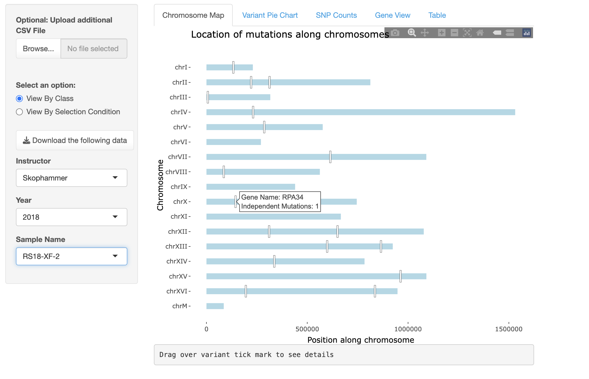
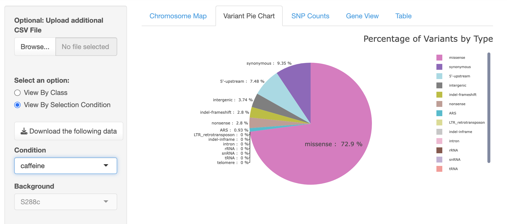
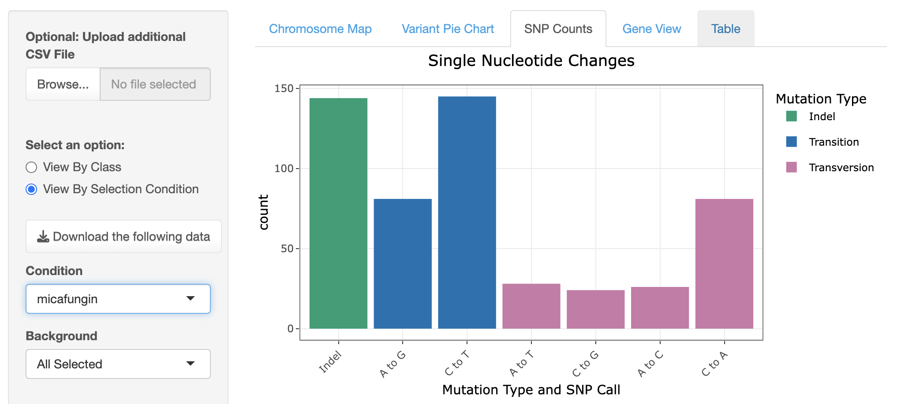
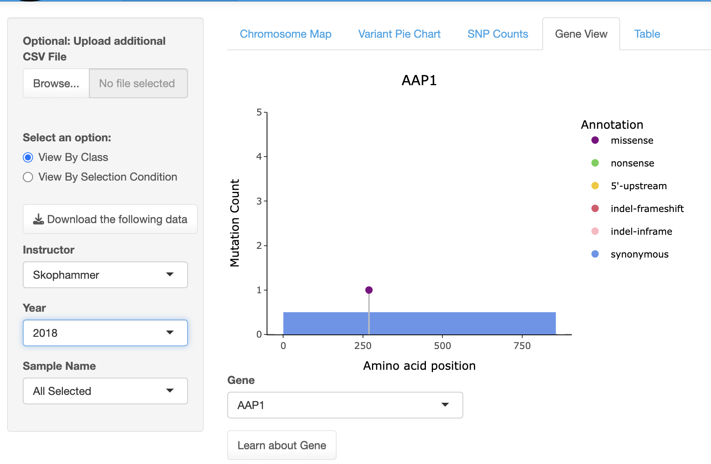

# yEvo Mutation Browser

Web tool enabling users to visualize evolved strain mutations in yEvo data at both the gene and chromosome levels, compare findings under various conditions, and upload users' own data, benefiting both educators and the yeast genetics community.

## Installation
The easiest method to use the mutation browser is to access it via the web [here](https://yevo.org/mutation-browser/)

To download the code, install the necessary packages, run the script, and edit the master files, please see below for [step by step instructions](#code-installation) 

TODO: What packages need to be downloaded for this to work? 


## Interface Design 
The yEvo Mutation browser contains two sections: the filtering column on the left and the visualizations on the right. Upon first loading, the app displays mutation data across the entire yEvo dataset. The user has the option to 1) change what data is being visualized (filtering) and 2) change the visualization method. Both options are detailed below.


## Filtering 

By default, the mutation browser displays all data. Users can filter this data in two ways: by student class or by selection condition. 
> As shown below, when selected, dropdowns appear corresponding to either option. 

<p align="center">
    

<div style="clear: both;">
    <pre>
    ├── View by Class                  
    │   ├── Instructor Dropdown                    
    │   ├── Year Dropdown                     
    │   └── Sample Name Dropdown                    
    └── View by Condition                  
        └── Condition Dropdown
    </pre>
</div>
Below is an example of filtering on the Chromosome Map


## Uploading Data (Temporarily)
- Default Data: The mutation browser is preloaded with all mutation data collected from yEvo experiments since 2018. Users can explore this dataset, or upload their own temporarily. 
- Data Format: To upload, users must have their mutation data (in .csv form) in the following format: 


After uploading, the browser will ask for additional information (instructor and year)


** TODO: dont we have helper tools to get this in the right format?  
Note: you can also permanently edit the master file such that your data will always appear in the browser. To do this, more instructions will be given below [here](#edit-the-master-vcf) (you also have to run the browser through locally/through the code installation)


## Visualization Methods 
- [Chromosome Map](#chromosome-map)
- [Variant Pie Chart](#variant-pie-chart)
- [SNP Counts](#snp-counts)
- [Gene View](#gene-view)

## Chromosome Map
 The Chromosome Map is a linear representation of the 16 nuclear chromosomes along with the mitochondrial genome of Saccharomyces cerevisiae. This plot displays the locations of all mutated genes in the selected dataset, marked at their chromosomal positions. Tick marks along the linear chromosomes indicate these sites, and hovering the mouse over each tick mark reveals the name of the mutated gene, as well as how many times it was mutated in repeat experiments. Users can also zoom in on specific regions by clicking and dragging, offering a closer look at mutations in a given area.
<div style="text-align: center;">
    
    <p>Default (Unfiltered) Chromosome Map</p>
</div>
<!-- <div style="text-align: center;">
    
    <p>Filtered Chromosome Map</p>
</div> -->

## Variant Pie Chart
The Variant Pie Chart displays the distribution of mutation types identified by the sequencing analysis pipeline. Unlike the chromosome plot, which focuses solely on the locations of mutated genes, the pie chart encompasses all variants, including those in non-coding regions.

<div style="text-align: center;">
    
    <p>Default (Unfiltered) Variant Pie Chart</p>
</div>
<!-- <div style="text-align: center;">
    
    <p>Filtered Variant Pie Chart</p>
</div> -->

## SNP Counts
This plot illustrates the distribution of single nucleotide polymorphisms (SNPs) and small insertions and deletions (indels). By categorizing the different types of SNPs, the mutation spectrum provides insights into the underlying biochemical processes that drive DNA mutations.

<div style="text-align: center;">
    
    <p>Default (Unfiltered) SNP Counts</p>
</div>
<!-- <div style="text-align: center;">
    
    <p>Filtered SNP Counts</p>
</div> -->

## Gene View
Gene View is a linear lollipop plot that displays the position of coding mutations along the protein product of each mutated gene. In this view, users can select a mutated gene from a dropdown menu based on the selected dataset. Once a gene is selected, the plot reveals the length of the amino acid sequence and color-coded lollipops indicating where mutations occurred. The colors differentiate between mutation types, such as missense, nonsense, synonymous, or 5’-upstream mutations. The height of each lollipop reflects how frequently that particular site in the protein was mutated within the dataset. 

<div style="text-align: center;">
    
    <p>Default (Unfiltered) Gene View</p>
</div>
<!-- <div style="text-align: center;">
    
    <p>Filtered Gene View</p>
</div> -->


### Code Installation
Otherwise, download the code from this repository, navigate it via the terminal and run 
``` Rscript app.R``` 

Then, it will tell you how to access it locally by saying something such as 

```Listening on http://xxxxxxx```. 

Copy and paste this link into a web browser of your choice to access the mutation browser

### Edit the Master VCF